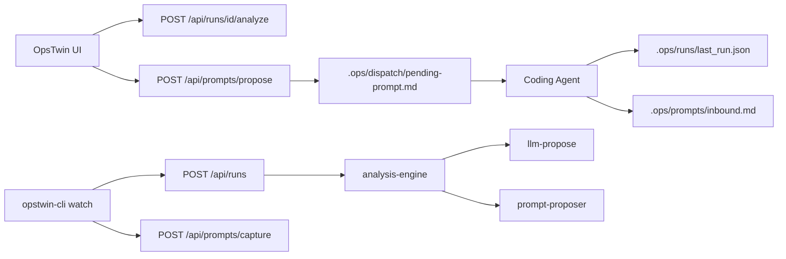

# OpsTwin Future Vision
# Full Auto-Watch Loop

| Version | 1.0 · 2026-05-27 |

---

## Vision

OpsTwin closes the loop between **human intent**, **agent execution**, and **continuous improvement**:

```
Watch everything → Analyze gaps → Improve prompt → One-click dispatch → Agent loops
```

No retyping prompts. No blind trust. Every iteration is audited, compared to the approved plan, and improved with LLM assistance (with rule-based fallback).

---

## Architecture



---

## User flows

### Flow A — Automatic watch

1. Run `node opstwin-cli.js watch` in the target repo
2. Agent completes work → writes audit JSON
3. CLI uploads audit **with stack context** (frontend/backend/database)
4. OpsTwin auto-creates a **draft proposal** (when `OPSTWIN_AUTO_PROPOSE=true`)
5. User clicks **Send to Agent** or runs `node opstwin-cli.js next --yes`

### Flow B — File-based prompt capture

1. Agent appends user prompts to `.ops/prompts/inbound.md`
2. `node opstwin-cli.js prompt-watch` POSTs captures to OpsTwin
3. Analysis engine uses captured prompt + audit for better proposals

### Flow C — Widget dashboard

1. Open OpsTwin dashboard
2. Drag widgets (metrics, gaps, terminal, draft prompt, PRD excerpt)
3. Layout persists in localStorage

---

## Safety gates

| Gate | Behavior |
|------|----------|
| No autonomous runs | Proposals stay `draft` until Approve or `opstwin next --yes` |
| LLM fallback | Rules-based propose when no API key or LLM fails |
| Audit required | Every agent run writes `.ops/runs/<id>/last_run.json` |
| No secrets in git | Never commit `.env.local` or API keys |

---

## Environment variables

| Variable | Default | Purpose |
|----------|---------|---------|
| `OPSTWIN_AUTO_PROPOSE` | `false` | Auto-create draft proposal on upload |
| `OPSTWIN_LLM_PROPOSE` | `true` | Use LLM for propose when key set |
| `GROQ_API_KEY` / `OPENAI_API_KEY` | — | LLM for plan + propose |

---

## CLI commands

| Command | Purpose |
|---------|---------|
| `watch` | Auto-upload audit JSON with stack context |
| `sync` | Upload audit + inbound prompt + terminal |
| `next --yes` | Propose → approve → dispatch |
| `prompt-watch` | Watch `.ops/prompts/inbound.md` |

---

## Related docs

- [MVP Roadmap](./MVP-ROADMAP.md)
- [API Specification](./API-SPECIFICATION.md)
- [Quickstart](./QUICKSTART.md)
